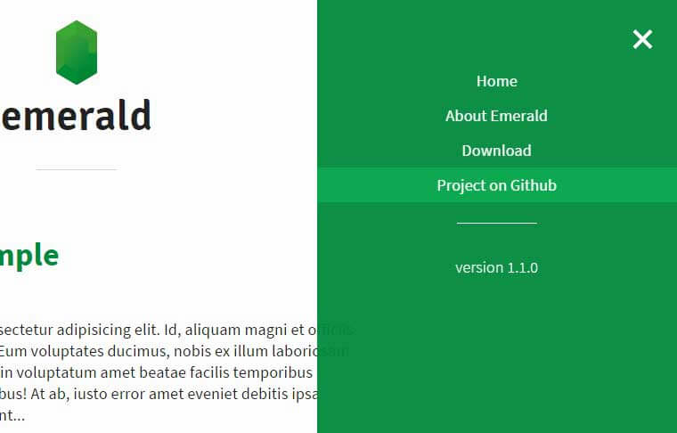

FUENTES:

+ [Build a blog with Jekyll and Github Pages](http://andrewbtran.github.io/JRN-418/class13/jekyll/)
+ [Smashing Magazine - Build A Blog With Jekyll And GitHub Pages](https://www.smashingmagazine.com/2014/08/build-blog-jekyll-github-pages/)

Al empezar a investigar sobre la implementación de sitios usando Jekyll lo primero que impacta es la abrumadora cantidad de información –oficial y no–, tutoriales, videos... 

Me parece que lo primero que conviene que tengamos en claro es que hay muchas maneras de empezar un sitio, especialmente si vamos a usar GitHub como hospedaje, pero las podemos agrupar en tres.

Paso a traducir lo que encontré en las fuentes antes citadas:

> ####  Hay algunas maneras de comenzar a usar Jekyll
>
> + Hacer un *fork* como un punto de partida, realizar cambios, súbelo a tu repositorio.
> + Clonar  un punto de partida en una máquina local, instalar Jekyll localmente a través de la línea de comando, realizar actualizaciones en el sitio web, compilarlo localmente y luego cargarlo de nuevo en su repositorio.
> + Instalar Jekyll localmente a través de la línea de comando, crear un nuevo sitio web predeterminado usando `jekyll new`, compilarlo localmente con `jekyll build` y luego cargarlo a un repositorio.
> Aquí hay una buena guía sobre la instalación a través de la línea de comando - [Jekyll](http://jekyllrb.com/docs/quickstart/)

La manera más rápida de empezar, donde ni siquiera tendremos que instalar nada en nuestras máquinas, es la primera mencionada: hacer un *fork* de alguna plantilla existente en GitHub, y luego configurar el sitio a nuestras necesidades.

> Posteriormente veremos cómo clonar nuestro trabajo localmente (esto es, a nuestra computadora), y sincronizar mediante **Git** aquello que testeemos o desarrollemos para su publicación en GitHub.

## Decisiones antes de arrancar con el sitio

1. Como el contenido del sitio tendrá que ver con un raconto cronológico de mis avances sobre la implementación de Jekyll –un *muy particular* diario–, el formato tipo **blog** puede ser adecuado para arrancar el sitio: la plantilla dede estar orientada a ese uso.
2. Usar un *fork* de una plantilla ya existente de manera de comenzar a trabajar directamente en GitHub... voy a "inspirarme" en el artículo de WebJeda [How to Create a Beautiful Jekyll Blog?](https://blog.webjeda.com/create-jekyll-blog/), y elegiré una super simple plantilla, llamada  [Emerald theme](http://www.jacoporabolini.com/emerald/). 
3. Como no estoy pensando en la opción *User website*, sino ***Project Website*** (ya que la cuenta de usuario **dsigno** la tengo pensada para varias pruebas y desarrollos...), habrá que cuidar de resolver algunos de los problemas que suelen presentarse debido a que el sitio será publicado en realidad a un subdirectorio, del tipo  `http://yourname.github.io/repository-name`, mientras que las plantillas son pensadas normalmente para URLs del tipo  `http://yourusername.github.io`.

***

De aquí en más, veremos en la próxima entrada los pasos para implementar la plantilla elegida y los problemas que irán apareciendo al tratar de configurarla...
